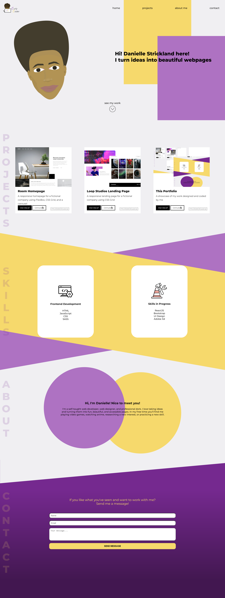

# Portfolio

This is my personal portfolio designed and coded by me showcasing what I have learned and created so far.

## Table of contents

- [Overview](#overview)
  - [The challenge](#the-challenge)
  - [Screenshot](#screenshot)
  - [Links](#links)
- [My process](#my-process)
  - [Built with](#built-with)
  - [What I learned](#what-i-learned)
  - [Challenges](#challenges)
  - [Continued development](#continued-development)
  - [Useful resources](#useful-resources)
- [Author](#author)
- [Acknowledgments](#acknowledgments)

## Overview

### The challenge

Design and code a portfolio that is responsive and showcases my knowledge and skills.

### Screenshot

### Links

- Live Site URL: https://www.curlycoder.com

## My process

### Built with

- Adobe XD
- Semantic HTML5 markup
- CSS Grid
- Mobile-first
- SCSS
- Javascript

### What I learned

This is the first website that I have ever designed and deployed. I discovered how much I enjoyed the design process while also realizing just how challenging it can be to implement complicated layouts. I also learned how to go through the process of registering and hosting a domain as well as deploying a website using SFTP.

### Challenges
- Design - Designing with accessibility in mind, choosing a color scheme that was colorblind friendly as well as meeting contrast standards that also fit the vibe I wanted to convey tripped me up. I also ran into issues with XD where my chosen fonts were no longer available causing me to be unable to see the completed project. I also created my own logo and favicon and I think designers need more credit for just how much goes into actually making these things.
- Development - I had major issues with the contact section layout. I wanted an angled section with a linear gradient going the full screen. I couldn't fix the issue (white space caused by the relatively positioned elements) but I created a workaround using the after psuedo-element that, while not great, got the job done.
- Deployment - Learning how to use FTP and enabling my SSL certificate

### Continued development

- I would like to make the mobile navigation close when the user chooses a link. 
- I would also like to add animation in some way. Maybe have the navbar slide out
- I was alerted to an issue with my layout in Safari browsers on mobile that I need to fix.
- Forms. I didn't realize how complex forms could really be until I needed to send the data and receive it.

### Useful resources

- [MDN Web Docs](https://developer.mozilla.org/en-US/) - My go-to resource for syntax and use examples

## Author
Danielle S.
- Frontend Mentor - [@dstrickl7](https://www.frontendmentor.io/profile/dstrickl7)
- Website - [Curly Coder](https://www.curlycoder.com)
- Github - [dstrickl7](https://github.com/dstrickl7)

## Acknowledgments
Devro Labs - creators of FormSubmit that allowed me to make my form functional